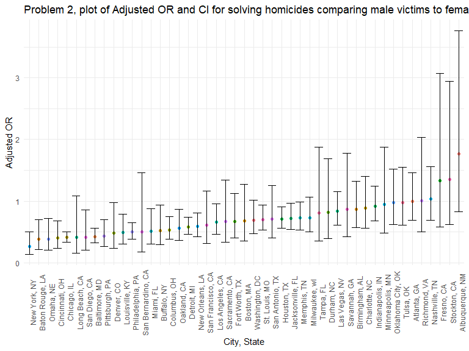
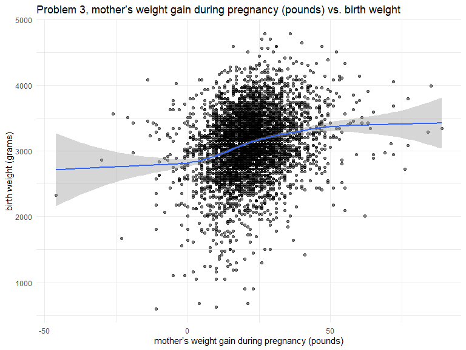
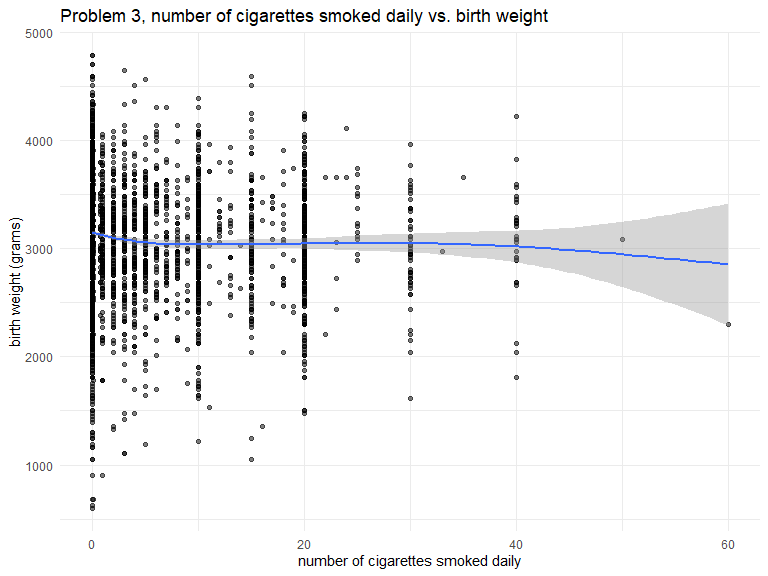
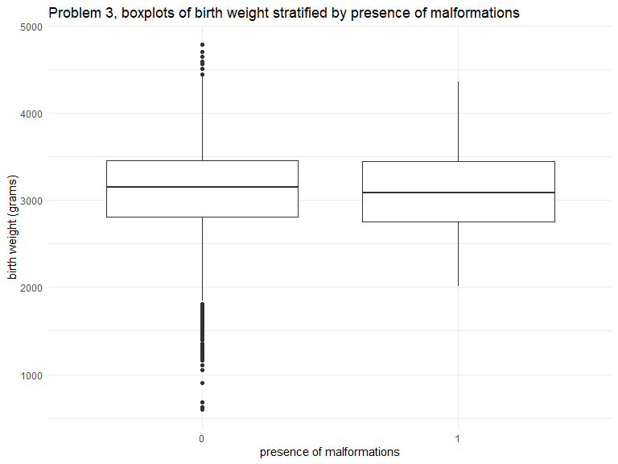
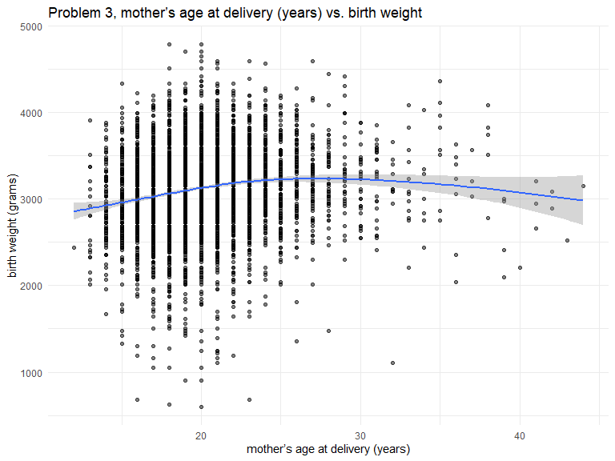
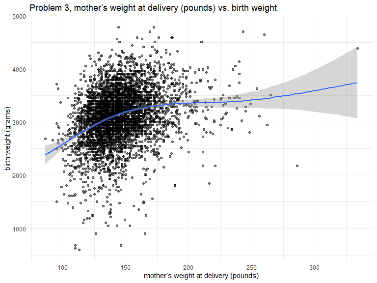
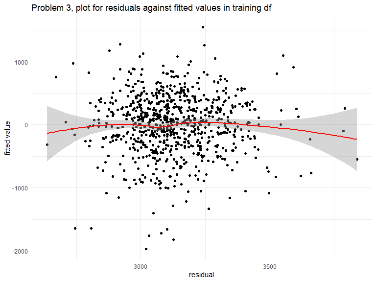
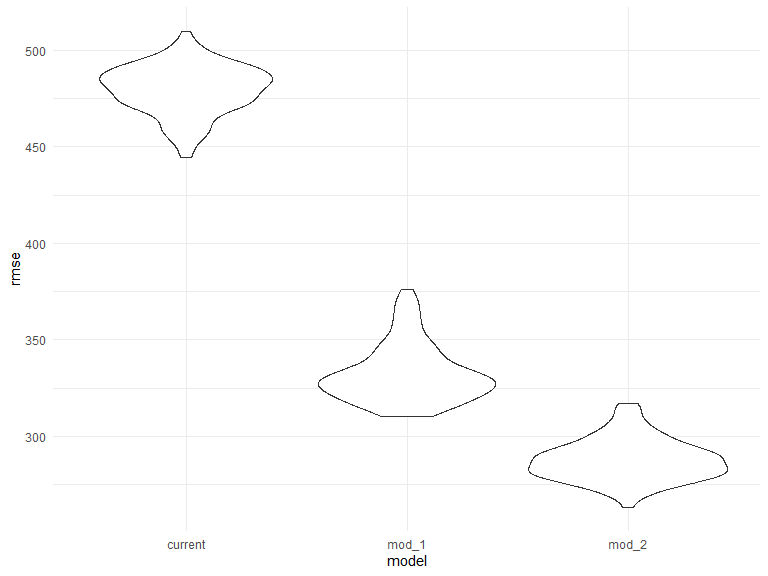

Homework 6 zz2901
================
Troy Zhou

    ## Warning: package 'purrr' was built under R version 4.2.2

## Problem 1

## Problem 2

Create a city_state variable (e.g. “Baltimore, MD”), and a binary
variable indicating whether the homicide is solved. Omit cities Dallas,
TX; Phoenix, AZ; and Kansas City, MO – these don’t report victim race.
Also omit Tulsa, AL – this is a data entry mistake. For this problem,
limit your analysis those for whom victim_race is white or black. Be
sure that victim_age is numeric.

``` r
homicide_clean <- read_csv("data/homicide-data.csv") %>% 
  mutate(resolved = as.numeric(disposition == "Closed by arrest"),
         victim_age = as.numeric(recode(victim_age,"Unknown"="")),
         city_state = paste0(city, ", ", state)) %>% 
  filter(!(city_state %in% c("Dallas, TX","Phoenix, AZ","Kansas City, MO","Tulsa, AL"))
         & victim_race %in% c("White", "Black"))
```

    ## Rows: 52179 Columns: 12
    ## ── Column specification ────────────────────────────────────────────────────────
    ## Delimiter: ","
    ## chr (9): uid, victim_last, victim_first, victim_race, victim_age, victim_sex...
    ## dbl (3): reported_date, lat, lon
    ## 
    ## ℹ Use `spec()` to retrieve the full column specification for this data.
    ## ℹ Specify the column types or set `show_col_types = FALSE` to quiet this message.

``` r
homicide_clean
```

    ## # A tibble: 39,693 × 14
    ##   uid        report…¹ victi…² victi…³ victi…⁴ victi…⁵ victi…⁶ city  state    lat
    ##   <chr>         <dbl> <chr>   <chr>   <chr>     <dbl> <chr>   <chr> <chr>  <dbl>
    ## 1 Alb-000003 20100601 SATTER… VIVIANA White        15 Female  Albu… NM    35.086
    ## 2 Alb-000005 20100102 MULA    VIVIAN  White        72 Female  Albu… NM    35.130
    ## 3 Alb-000006 20100126 BOOK    GERALD… White        91 Female  Albu… NM    35.151
    ## 4 Alb-000009 20100130 MARTIN… GUSTAVO White        56 Male    Albu… NM    35.075
    ## 5 Alb-000012 20100218 LUJAN   KEVIN   White        NA Male    Albu… NM    35.077
    ## # … with 39,688 more rows, 4 more variables: lon <dbl>, disposition <chr>,
    ## #   resolved <dbl>, city_state <chr>, and abbreviated variable names
    ## #   ¹​reported_date, ²​victim_last, ³​victim_first, ⁴​victim_race, ⁵​victim_age,
    ## #   ⁶​victim_sex
    ## # ℹ Use `print(n = ...)` to see more rows, and `colnames()` to see all variable names

For the city of Baltimore, MD, use the glm function to fit a logistic
regression with resolved vs unresolved as the outcome and victim age,
sex and race as predictors. Save the output of glm as an R object; apply
the broom::tidy to this object; and obtain the estimate and confidence
interval of the adjusted odds ratio for solving homicides comparing male
victims to female victims keeping all other variables fixed.

``` r
fit_logistic = 
  homicide_clean %>% 
  filter(city_state=="Baltimore, MD") %>% 
  glm(resolved ~ victim_age + victim_sex + victim_race, data = ., 
      family = binomial())

baltimore_df = fit_logistic %>% 
  broom::tidy() %>% 
  mutate(OR = exp(estimate),
         LCL = exp(estimate-1.96*std.error),
         UCL = exp(estimate+1.96*std.error)) %>%
  select(term, log_OR = estimate, OR, LCL, UCL) %>% 
  knitr::kable(digits = 3)

baltimore_df
```

| term             | log_OR |    OR |   LCL |   UCL |
|:-----------------|-------:|------:|------:|------:|
| (Intercept)      |  0.310 | 1.363 | 0.975 | 1.907 |
| victim_age       | -0.007 | 0.993 | 0.987 | 1.000 |
| victim_sexMale   | -0.854 | 0.426 | 0.325 | 0.558 |
| victim_raceWhite |  0.842 | 2.320 | 1.648 | 3.268 |

- From the output in the table, the estimated odds ratio of having
  homicide solved between male and female victims is 0.426, adjusting
  for victim age and race, in Baltimore, MD.

- We are 95% confident that the true odds ratio of having homicide
  solved between male and female victims lies between 0.325 and 0.558,
  adjusting for victim age and race, in Baltimore, MD.

Now run glm for each of the cities in your dataset, and extract the
adjusted odds ratio (and CI) for solving homicides comparing male
victims to female victims. Do this within a “tidy” pipeline, making use
of purrr::map, list columns, and unnest as necessary to create a
dataframe with estimated ORs and CIs for each city.

``` r
calc_or <- function(x){

  glm(resolved ~ victim_age + victim_sex + victim_race, data = x,
      family = binomial()) %>% 
  broom::tidy() %>%
  mutate(OR = exp(estimate),
         LCL = exp(estimate-1.96*std.error),
         UCL = exp(estimate+1.96*std.error)) %>%
  filter(term=="victim_sexMale") %>% 
  select(log_OR = estimate, OR, LCL, UCL)

}


homicide_nest = homicide_clean %>% 
  nest(data = -city_state) %>% 
  mutate(estimates = map(data,calc_or)) %>% 
  unnest(estimates) %>% 
  select(city_state, OR, LCL, UCL)

homicide_nest
```

    ## # A tibble: 47 × 4
    ##   city_state           OR     LCL     UCL
    ##   <chr>             <dbl>   <dbl>   <dbl>
    ## 1 Albuquerque, NM 1.7675  0.83066 3.7609 
    ## 2 Atlanta, GA     1.0001  0.68360 1.4631 
    ## 3 Baltimore, MD   0.42551 0.32456 0.55787
    ## 4 Baton Rouge, LA 0.38144 0.20925 0.69531
    ## 5 Birmingham, AL  0.87002 0.57430 1.3180 
    ## # … with 42 more rows
    ## # ℹ Use `print(n = ...)` to see more rows

Create a plot that shows the estimated ORs and CIs for each city.
Organize cities according to estimated OR, and comment on the plot.

``` r
homicide_nest %>% 
  ggplot(aes(reorder(city_state,OR), OR)) +       
  geom_point(aes(color=city_state)) +
  geom_errorbar(aes(ymin = LCL, ymax = UCL))+
    labs(
    title = "Problem 2, plot of Adjusted OR and CI for solving homicides comparing male victims to female victims In each city ",
    x = "City, State",
    y = "Adjusted OR") +
   theme(axis.text.x = element_text(angle = 90),
         legend.position = "none")
```



- From the plot, we can see the majority of adjusted ORs have their
  values and upper CI below 1, which means mostly male victims have
  smaller odds of solved homicide case than females.

- Decent amount of ORs are not significent as their CIs contain the null
  value of 1.

## Problem 3

Load and clean the data for regression analysis (i.e. convert numeric to
factor where appropriate, check for missing data, etc.).

``` r
birth_wt <- read.csv("data/birthweight.csv") %>% 
  mutate(babysex=as.factor(babysex),
         frace=as.factor(frace),
         mrace=as.factor(mrace),
         malform=as.factor(malform),
         id=row_number())

str(birth_wt)
```

    ## 'data.frame':    4342 obs. of  21 variables:
    ##  $ babysex : Factor w/ 2 levels "1","2": 2 1 2 1 2 1 2 2 1 1 ...
    ##  $ bhead   : int  34 34 36 34 34 33 33 33 36 33 ...
    ##  $ blength : int  51 48 50 52 52 52 46 49 52 50 ...
    ##  $ bwt     : int  3629 3062 3345 3062 3374 3374 2523 2778 3515 3459 ...
    ##  $ delwt   : int  177 156 148 157 156 129 126 140 146 169 ...
    ##  $ fincome : int  35 65 85 55 5 55 96 5 85 75 ...
    ##  $ frace   : Factor w/ 5 levels "1","2","3","4",..: 1 2 1 1 1 1 2 1 1 2 ...
    ##  $ gaweeks : num  39.9 25.9 39.9 40 41.6 ...
    ##  $ malform : Factor w/ 2 levels "0","1": 1 1 1 1 1 1 1 1 1 1 ...
    ##  $ menarche: int  13 14 12 14 13 12 14 12 11 12 ...
    ##  $ mheight : int  63 65 64 64 66 66 72 62 61 64 ...
    ##  $ momage  : int  36 25 29 18 20 23 29 19 13 19 ...
    ##  $ mrace   : Factor w/ 4 levels "1","2","3","4": 1 2 1 1 1 1 2 1 1 2 ...
    ##  $ parity  : int  3 0 0 0 0 0 0 0 0 0 ...
    ##  $ pnumlbw : int  0 0 0 0 0 0 0 0 0 0 ...
    ##  $ pnumsga : int  0 0 0 0 0 0 0 0 0 0 ...
    ##  $ ppbmi   : num  26.3 21.3 23.6 21.8 21 ...
    ##  $ ppwt    : int  148 128 137 127 130 115 105 119 105 145 ...
    ##  $ smoken  : num  0 0 1 10 1 0 0 0 0 4 ...
    ##  $ wtgain  : int  29 28 11 30 26 14 21 21 41 24 ...
    ##  $ id      : int  1 2 3 4 5 6 7 8 9 10 ...

``` r
sapply(birth_wt, function(x) sum(is.na(x)))
```

    ##  babysex    bhead  blength      bwt    delwt  fincome    frace  gaweeks 
    ##        0        0        0        0        0        0        0        0 
    ##  malform menarche  mheight   momage    mrace   parity  pnumlbw  pnumsga 
    ##        0        0        0        0        0        0        0        0 
    ##    ppbmi     ppwt   smoken   wtgain       id 
    ##        0        0        0        0        0

- `babysex`, `frace`, `mrace` were converted to factor variables.

- No missing values in the dataframe.

Propose a regression model for birthweight. This model may be based on a
hypothesized structure for the factors that underly birthweight, on a
data-driven model-building process, or a combination of the two.
Describe your modeling process and show a plot of model residuals
against fitted values – use add_predictions and add_residuals in making
this plot.

``` r
library(modelr)
library(mgcv)
```

    ## Loading required package: nlme

    ## 
    ## Attaching package: 'nlme'

    ## The following object is masked from 'package:dplyr':
    ## 
    ##     collapse

    ## This is mgcv 1.8-40. For overview type 'help("mgcv-package")'.

``` r
set.seed(1)

train_df = sample_n(birth_wt, 800)
test_df = anti_join(birth_wt, train_df, by = "id")


birth_wt %>% 
  ggplot(aes(x = wtgain, y = bwt)) + 
  geom_point(alpha=.5) + 
  geom_smooth()+
  labs(title = "Problem 3, mother’s weight gain during pregnancy (pounds) vs. birth weight",
       x = "mother’s weight gain during pregnancy (pounds)",
       y = "birth weight (grams)"
  )
```

    ## `geom_smooth()` using method = 'gam' and formula 'y ~ s(x, bs = "cs")'



``` r
birth_wt %>% 
  ggplot(aes(x=smoken,y = bwt)) + 
  geom_point(alpha=.5) + 
  geom_smooth() + 
  labs(title = "Problem 3, number of cigarettes smoked daily vs. birth weight",
       x = "number of cigarettes smoked daily",
       y = "birth weight (grams)"
  )
```

    ## `geom_smooth()` using method = 'gam' and formula 'y ~ s(x, bs = "cs")'



``` r
birth_wt %>% 
  ggplot(aes(x=malform,y = bwt)) + 
  geom_boxplot(aes(group=malform)) + 
  labs(title = "Problem 3, boxplots of birth weight stratified by presence of malformations",
       x = "presence of malformations",
       y = "birth weight (grams)"
  )
```



``` r
birth_wt %>% 
  ggplot(aes(x = momage, y = bwt)) + 
  geom_point(alpha=.5) + 
  geom_smooth() + 
  labs(title = "Problem 3, mother’s age at delivery (years) vs. birth weight",
       x = "mother’s age at delivery (years)",
       y = "birth weight (grams)"
  )
```

    ## `geom_smooth()` using method = 'gam' and formula 'y ~ s(x, bs = "cs")'



``` r
birth_wt %>% 
  ggplot(aes(x = delwt, y = bwt)) + 
  geom_point(alpha=.5) + 
  geom_smooth() + 
  labs(title = "Problem 3, mother’s weight at delivery (pounds) vs. birth weight",
       x = "mother’s weight at delivery (pounds)",
       y = "birth weight (grams)"
  )
```

    ## `geom_smooth()` using method = 'gam' and formula 'y ~ s(x, bs = "cs")'



- From exploring the distribution of some suspected variables versus
  birth weight, we can see no clear relationship between cigarette
  smoked and birth weight nor between presence of malformations and
  birth weight nor between mother’s age at delivery and birth weight.

- However, some correlation between mom’s weight gain and birth weight
  as well as between weight at delivery and birth weight.

- Therefore, we will use weight gain and weight at delivery as the
  predictors.

``` r
linear_mod = lm(bwt ~ wtgain+delwt, data = train_df)
smooth_mod = gam(bwt ~ s(wtgain)+s(delwt), data = train_df)
wiggly_mod = gam(bwt ~ s(wtgain)+s(delwt, k = 30), sp = 10e-6, data = train_df)


rmse(linear_mod, test_df)
```

    ## [1] 488.6445

``` r
rmse(smooth_mod, test_df)
```

    ## [1] 486.0711

``` r
rmse(wiggly_mod, test_df)
```

    ## [1] 504.2605

- From the three graphs, we can tell the smooth or standard gam fit
  reflect a more accurate diminishing positive relationship.

- Combined with the fact that the smooth fit has the smallest root mean
  squared errors, the standard gam model might be better.

``` r
train_df %>% 
  add_predictions(smooth_mod) %>% 
  add_residuals(smooth_mod) %>% 
  ggplot(aes(x = pred, y = resid)) + geom_point() + 
  geom_smooth( color = "red") +
  labs(title = "Problem 3, plot for residuals against fitted values in training df",
       x = "residual",
       y = "fitted value"
  )
```

    ## `geom_smooth()` using method = 'loess' and formula 'y ~ x'



- From the plot we can see residuals are fairly evenly distributed
  around 0 in training df.

Compare your model to two others:

1)  One using length at birth and gestational age as predictors (main
    effects only)

2)  One using head circumference, length, sex, and all interactions
    (including the three-way interaction) between these

Make this comparison in terms of the cross-validated prediction error;
use crossv_mc and functions in purrr as appropriate.

Note that although we expect your model to be reasonable, model building
itself is not a main idea of the course and we don’t necessarily expect
your model to be “optimal”.

``` r
  crossv_mc(birth_wt, 100) %>% 
  mutate(
    train = map(train, as_tibble),
    test = map(test, as_tibble),
    current_mod = map(train, ~gam(bwt ~ s(wtgain) + s(delwt), data = .x)),
    other_mod_1  = map(train, ~lm(bwt ~ blength + gaweeks, data = .x)),
    other_mod_2  = map(train, ~lm(bwt ~ bhead + blength + babysex + bhead*blength + bhead*babysex + bhead*blength*babysex, data = .x))) %>% 
  mutate(
    rmse_current = map2_dbl(current_mod, test, ~rmse(model = .x, data = .y)),
    rmse_mod_1 = map2_dbl(other_mod_1, test, ~rmse(model = .x, data = .y)),
    rmse_mod_2 = map2_dbl(other_mod_2, test, ~rmse(model = .x, data = .y))) %>% 
  select(starts_with("rmse")) %>% 
  pivot_longer(
    everything(),
    names_to = "model", 
    values_to = "rmse",
    names_prefix = "rmse_") %>% 
  mutate(model = fct_inorder(model)) %>% 
  ggplot(aes(x = model, y = rmse)) + geom_violin()
```



- The model chosen before using weight gain during pregnancy and weight
  at delivery is clearly “worse” than the other two given its much
  higher RMSE.

- However, this was expected as the other two models are predicting baby
  weight using the baby’s measurements (head circumference and baby
  length). These predictors are highly correlated with birth weight but
  carry little clinical meaning. There is not much point in predicting a
  baby’s birthright after they are born and using their measurements.

- Using my proposed predictors of mothers’ weight measurements, we can
  at least actually predict the baby’s weight before birth and study
  what factors are actually affecting birth weight. Hence, the proposed
  model is more clinically meansingful.
